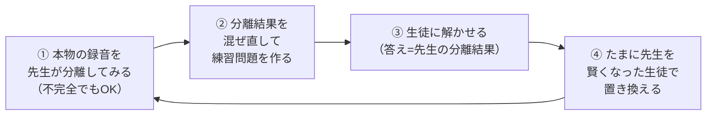
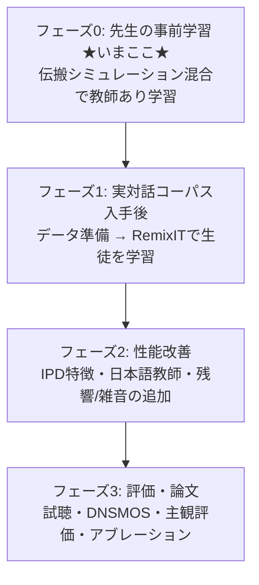

# この研究でやっていること

  

## 1. 何を作ろうとしているのか

  

### 録音の仕組み

  

2人の話者（AさんとBさん）が、それぞれ首掛け式のウェアラブルマイク

（Thinklet）を装着して会話を録音します。すると2チャンネルの音声ができます：

  

```

左チャンネル（Aさんのマイク）: Aさんの声（大きい）+ Bさんの声（小さく漏れ込む）

右チャンネル（Bさんのマイク）: Bさんの声（大きい）+ Aさんの声（小さく漏れ込む）

```

  

どちらのマイクにも**両方の声が混ざって**録音されます。自分のマイクには

自分の声が大きく入りますが、相手の声もそれなりに入ってしまいます。

  

### ゴール

  

この「混ざった2チャンネル音声」をAIに入力して、

**「Aさんだけの声」と「Bさんだけの声」を取り出す**こと。これを

**話者分離**と呼びます。狙いどころは、**各マイクが「自分の装着者の声（大きい）＋

相手の声（小さく漏れ込む）」という非対称な構造を持つ**点で、この偏りを手がかりに

分離します。

  

> **対象データについて**: 本来の対象はウェアラブルマイクで収録した実対話コーパス

> ですが、手元に十分な量がありません。そこで当面は後述のシミュレーションで

> 学習データを作ります。実データ（入手交渉中）が手に入ったら、RemixIT での適応と

> 最終評価に使う計画です。

  

---

  

## 2. なぜ普通のAI学習ができないのか

  

AIの学習は普通、「問題」と「正解」のペアで行います。

話者分離なら「混ざった音声（問題）」と「混ざる前のきれいな声（正解）」です。

  

ところが本物の会話録音では、**「混ざる前のきれいな声」は存在しません**。

マイクに入った時点ですでに混ざっているからです。正解がないので、

普通の学習（教師あり学習）ができない——これがこの研究の最大の難所です。

  

---

  

## 3. 解決策：先生と生徒の2人三脚（RemixIT）

  

正解がなくても学習できる **RemixIT** という手法（2022年の論文）を使います。

登場人物は2つのAIです。

  

| 役割 | 説明 |

|---|---|

| 先生（Teacher） | 事前に別のデータで訓練しておいた分離AI。完璧ではないがそこそこ分離できる |

| 生徒（Student） | これから実対話データで鍛える分離AI。最終的に使うのはこちら |

  

学習の1サイクルはこうなります：

  



  

ポイントは②です。先生の分離結果を**自分たちで混ぜ直す**ので、

「どう混ぜたか」を完全に知っています。つまり**答えがわかっている練習問題を

無限に作れる**わけです。生徒がこの問題を解けるようになると、本物の録音も

分離できるようになっていきます。④で先生を定期的に更新すると、

問題の質も上がっていき、らせん状に性能が向上します。

  

### この手法の絶対条件

  

**先生は最初からある程度分離ができないといけません。**

何も知らない先生（ランダムな状態）だと、出てくる「答え」がデタラメなので、

生徒はデタラメを覚えるだけになります。そこで——

  

---

  

## 4. いまやっていること：先生の事前学習（フェーズ0）

  

実対話コーパスがまだ手元に十分ないので、その間に**シミュレーションで先生を

育てています**。

  

### 教材の作り方（シミュレーション）

  

「きれいな1人の声」を集めた公開コーパス

（LibriSpeech：英語のオーディオブック朗読、100時間・251人）を使い、

**ウェアラブルマイク風の2ch録音をコンピュータ上で再現**します。

ポイントは、ただ音量を変えて足すのではなく、**実際の音の伝わり方を物理的に

再現する**ことです：

  

- 2人の話者を、それぞれ自分のマイクの近く・相手のマイクの遠くに「配置」する

- 各マイクへ届く音を、**距離による減衰（遠いほど小さい）**と

  **到達の時間差（遠いほど遅れて届く）**を計算して合成する

  

```

左ch = (Aさんの声が左マイクに届いた音) + (Bさんの声が左マイクに届いた音)

右ch = (Aさんの声が右マイクに届いた音) + (Bさんの声が右マイクに届いた音)

```

  

こうすると、左右のマイクで音量だけでなく**届くタイミングもわずかにずれます**。

この時間差は「左右の耳で音源の方向を当てる」のと同じ手がかりで、2chモデルが

一番得意とする情報です。以前の「音量だけ変えて足す」やり方ではこの手がかりが

ゼロだったので、今回**伝搬モデルに切り替えたのが直近の大きな改善**です。

  

人工的に作ったので「混ぜる前のきれいな声」＝正解を持っています。これで普通の

教師あり学習ができ、本物の録音と構造がそっくりな練習問題で先生を鍛えられます。

配置（マイク間隔・話者の位置）は1問ごとにランダムに変え、特定の配置に

偏らないようにしています。

  

> **Q. 英語で訓練して日本語に使えるの？**

> 「声と声を聞き分ける」能力は言語にあまり依存しないことが知られています。

> さらに、実データが手に入ったらRemixITで微調整（ファインチューン）するので、

> 先生は出発点として十分です。なお日本語コーパス（JVS）が入手できたら

> 日本語で作り直すことも計画しています。

  

> **次の改善候補**: いまの伝搬モデルは「無響室」想定で、**残響（反射音）と雑音**は

> まだ入っていません。実録音に近づけるなら `pyroomacoustics` で部屋の反射を

> 加えるのが次のステップです（[architecture.md](architecture.md) 参照）。

  

### 学習の規模

  

| 項目 | 値 |

|---|---|

| モデル | TF-Locoformer（約1500万パラメータ） |

| GPU | RTX 2080Ti ×1（研究室サーバー g12） |

| 1エポック | 約25分（2000ステップ＋検証300問） |

| 上限 | 150エポック（約2.5日）。改善が止まれば自動早期終了 |

| 進捗の確認 | W&B: https://wandb.ai/97kuek-waseda-university/egocentric-sep |

  

### GPUメモリとの戦い

  

このモデルは本来もっと大きなGPU向けで、そのままでは11GBに入りませんでした。

3つの工夫で解決しています（実測値は [architecture.md](architecture.md) の表参照）：

  

1. **混合精度学習（AMP）** — 計算を16bit精度で行いメモリ半減

2. **勾配累積** — 1問ずつ4回解いてからまとめて重みを更新（実質バッチ4）

3. **周波数解像度の調整** — STFTの窓を論文の16kHz標準設定に（メモリ半減）

  

---

  

## 5. 全体の道のりと現在地

  



  

## 6. 学習の様子を見る方法

  

```bash

# 方法1: ブラウザで損失グラフを見る（スマホでも可）

# → https://wandb.ai/97kuek-waseda-university/egocentric-sep

  

# 方法2: サーバーで学習画面に入る

tmux attach -t kueki_teacher     # 抜けるときは Ctrl+B → D（学習は止まらない）

  

# 方法3: ログファイルを見る

tail -f ~/exp/teacher_sim/train.log

```

  

**見方**: `valid_loss` という数字が**下がっていれば順調**です。

これは「検証問題での分離の下手さ」を表す数字で、-10 なら平均SI-SNR 10dB

（おおまかに「混ざった声の9割のエネルギーを正しく振り分けられる」レベル）。

  

## 7. 用語ミニ辞典

  

| 用語 | 意味 |

|---|---|

| 話者分離 | 混ざった複数人の声を1人ずつに分けること |

| 自己教師あり学習 | 正解データなしで、データ自身から練習問題を作って学習する方法 |

| エポック | 学習の1周期。「練習セットを1回分こなす」単位 |

| バッチ | 1回の重み更新でまとめて解く問題数 |

| 損失（loss） | AIの「下手さ」を測る数字。学習はこれを下げる作業 |

| SI-SNR | 分離のきれいさを測る指標（dB）。大きいほど良い |

| STFT | 音を「時間×周波数の地図」に変換する処理。モデルはこの地図上で動く |

| チェックポイント | 学習途中のモデルを保存したファイル（.pth） |

| AMP / 混合精度 | 計算精度を一部落としてメモリと時間を節約する技術 |

| W&B (Weights & Biases) | 学習の進み具合をブラウザでグラフ表示してくれるサービス |