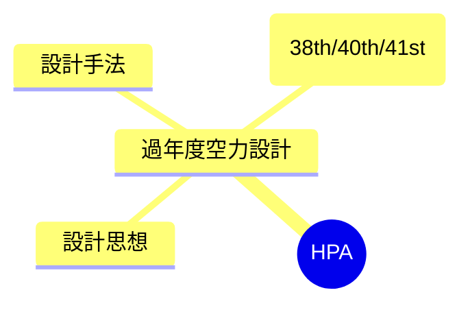

---
tags:
  - MOC
aliases:
  - HPA
  - 人力飛行機
created: 2026-06-14
status: active
---
## 概要・目的

人力飛行機（鳥人間コンテスト機）の空力設計プロジェクトのハブMOC。WASAでの機体設計・製作・テストフライトに関する知識と進捗をまとめる。

## 構造マップ

## 主要ノート

- [[過年度空力設計]] — 過去3代（38th/40th/41st）の空力設計引継ぎまとめ

## 関連MOC・上位MOC

- 上位: [[【MOC】10_Projects]]
- 関連: 

## メモ・気づき

---
**最終更新:** `= this.file.mtime`
