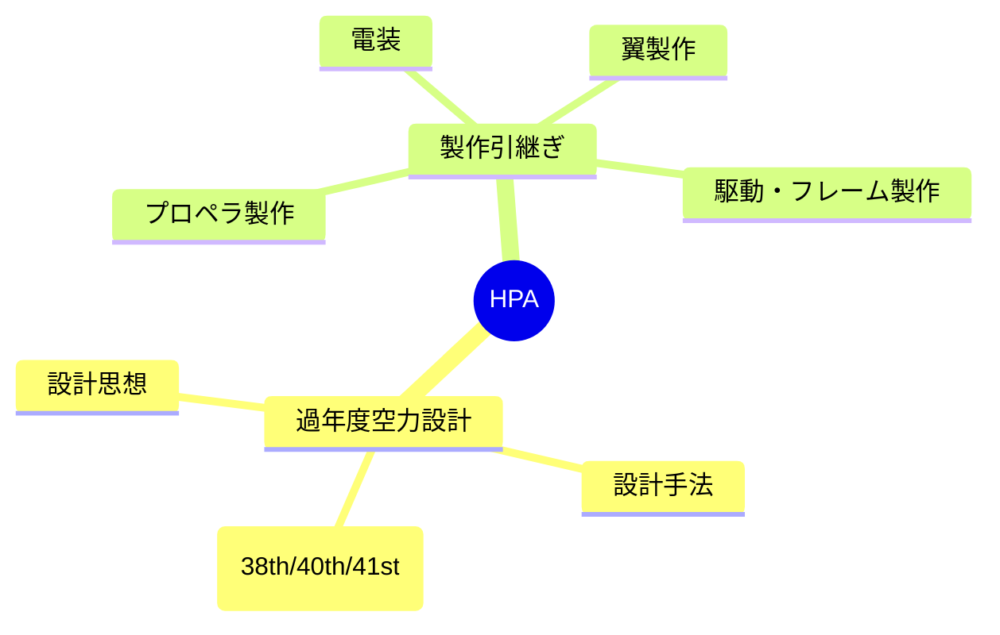

---
tags:
  - MOC
aliases:
  - HPA
  - 人力飛行機
created: 2026-06-14
status: active
---
## 概要・目的

人力飛行機（鳥人間コンテスト機）の空力設計プロジェクトのハブMOC。WASAでの機体設計・製作・テストフライトに関する知識と進捗をまとめる。

## 構造マップ

## 主要ノート

- [[過年度空力設計]] — 過去3代（38th/40th/41st）の空力設計引継ぎまとめ
- [[プロペラ製作]] — プロペラ班の製作ノウハウ（発注・成形・積層・塗装）
- [[翼製作]] — 翼班の製作ノウハウ（リブ・後縁材・リブ立て・プランク）
- [[電装]] — 電装班の引継ぎ（操舵・計測・基板・LiPo安全）
- [[駆動・フレーム製作]] — 駆動・フレーム班の製作ノウハウ（かんざし・フレーム・駆動部）

## 関連MOC・上位MOC

- 上位: [[【MOC】10_Projects]]
- 関連: 

## メモ・気づき

---
**最終更新:** `= this.file.mtime`
