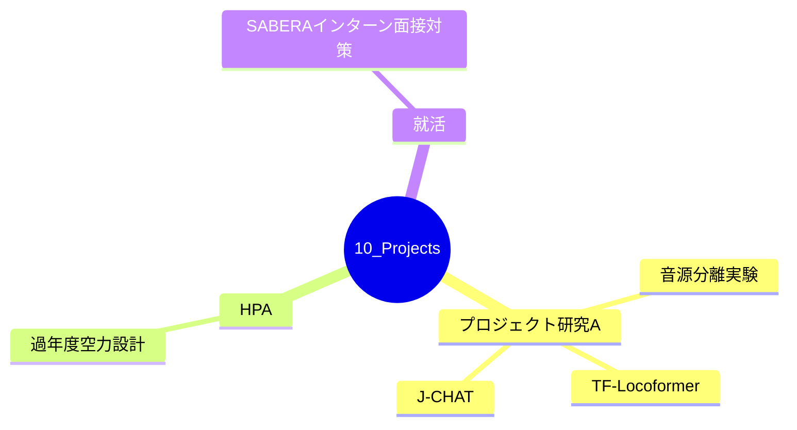

---
tags:
  - MOC
aliases:
  - Projects
  - プロジェクト一覧
created: 2026-05-12
status: active
---
## 概要・目的

期限・ゴールのあるアクティブなプロジェクトのハブMOC。完了したプロジェクトは `40_Archives/` へ移動する。

## 構造マップ

## アクティブなプロジェクト

- [[【MOC】プロジェクト研究A]]
- [[【MOC】HPA]]
- [[SABERAインターン面接対策]]

## 関連MOC・上位MOC

- 上位: [[Home]]
- 関連: [[【MOC】20_Areas]]

## メモ・気づき

---
**最終更新:** `= this.file.mtime`
