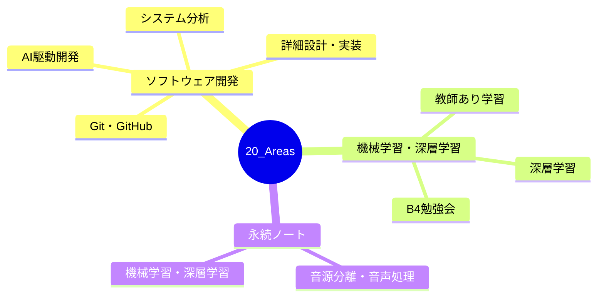

---
tags:
  - MOC
aliases:
  - Areas
  - エリア
created: 2026-05-09
status: active
---
## 概要・目的

継続的に管理・学習しているトピックエリアのハブMOC。

## 構造マップ

## 主要MOC

- [[【MOC】ソフトウェア開発]]
- [[【MOC】機械学習・深層学習]]
- [[【MOC】永続ノート]]

## 関連MOC・上位MOC

- 上位: [[Home]]
- 関連: [[【MOC】プロジェクト研究A]]

## 未整理・Inbox

- [ ] 

## メモ・気づき

---
**最終更新:** `= this.file.mtime`
