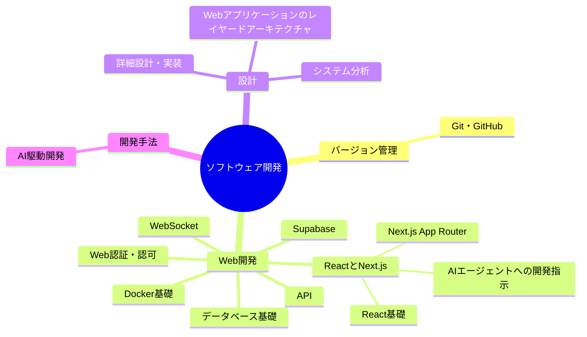

---
tags:
  - MOC
aliases:
  - ソフトウェア
  - 開発
created: 2026-05-09
status: active
---
## 概要・目的

ソフトウェア開発・設計で役に立つ知識や技術などをまとめたMOC。

## 構造マップ



## 主要ノート

- [[Git・GitHub]]
- [[システム分析]]
- [[詳細設計・実装]]
- [[AI駆動開発]]
- [[Claude Code運用]] — 大規模コードベースのハーネス設計・トークン節約
- [[ReactとNext.js]] — React基礎・Next.js App Router・Server Components/Actions
- [[React基礎]] — コンポーネント・JSX・props/state・useEffect
- [[Next.js App Router]] — App Router・Server/Client Components・Server Actions
- [[AIエージェントへの開発指示]] — Next.js実装を依頼・レビューするときの観点
- [[API]] — Web API・REST API・リクエスト/レスポンス・Next.js API Route
- [[データベース基礎]] — DB・SQL・設計・アプリ連携を6単元に分けた基礎ノートのハブ
- [[WebSocket]] — HTTP Upgrade・フレーム・双方向通信・実務上の注意
- [[Docker基礎]] — Dockerfile・イメージ・コンテナ・ネットワーク・ボリューム・Compose
- [[Supabase]] — Postgres中心のBaaS・Auth・RLS・PostgREST
- [[Web認証・認可]] — 認証/認可・セッション/JWT・OAuth/OIDC
- [[Webアプリケーションのレイヤードアーキテクチャ]] — 画面層・API層・UseCase層・Domain層・Infrastructure層

## 関連MOC・上位MOC

- 上位: [[【MOC】20_Areas]]
- 関連: 

## 未整理・Inbox

- [ ] 

## 動的クエリ（Dataview）

```dataview
LIST
FROM "20_Areas/ソフトウェア開発"
WHERE !contains(file.name, "MOC")
SORT file.mtime DESC
LIMIT 20
```

## メモ・気づき

---
**最終更新:** `= this.file.mtime`
