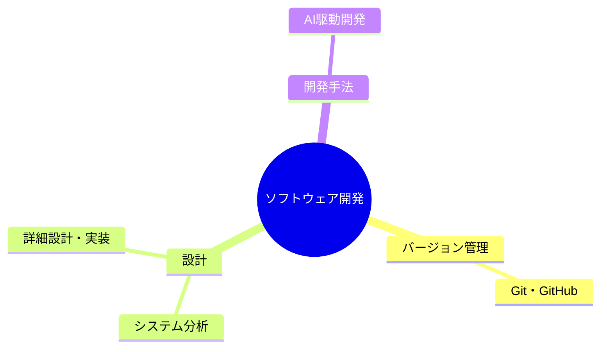

---
tags:
  - MOC
aliases:
  - ソフトウェア
  - 開発
created: 2026-05-09
status: active
---
## 概要・目的

ソフトウェア開発・設計で役に立つ知識や技術などをまとめたMOC。

## 構造マップ



## 主要ノート

- [[Git・GitHub]]
- [[システム分析]]
- [[詳細設計・実装]]
- [[AI駆動開発]]
- [[Claude Code運用]] — 大規模コードベースのハーネス設計・トークン節約

## 関連MOC・上位MOC

- 上位: [[【MOC】20_Areas]]
- 関連: 

## 未整理・Inbox

- [ ] 

## 動的クエリ（Dataview）

```dataview
LIST
FROM "20_Areas/ソフトウェア開発"
WHERE !contains(file.name, "MOC")
SORT file.mtime DESC
LIMIT 20
```

## メモ・気づき

---
**最終更新:** `= this.file.mtime`
