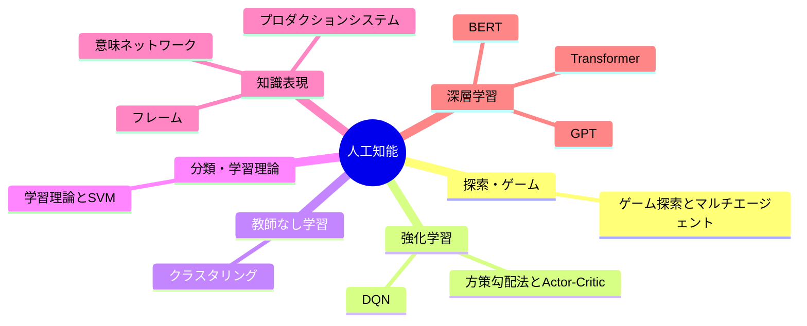

---
tags:
  - MOC
aliases:
  - 人工知能MOC
  - 【MOC】機械学習・深層学習
  - ML
  - 機械学習
  - 深層学習
  - AI・機械学習・深層学習の関係
created: 2026-05-09
status: active
---
## 概要・目的

人工知能を上位概念とし、記号AI、探索、機械学習、深層学習、強化学習の知識を体系的に整理したMOCである。

## AI・機械学習・深層学習の関係

- **人工知能（AI）**：人間のような知的処理を機械で実現する技術・研究分野全体である。ルールベースのシステムから深層学習までを含む。
- **機械学習（ML）**：人間が規則を直接記述するのではなく、データから規則性を学習するAIの一分野である。
- **深層学習（DL）**：多層ニューラルネットワークを用いる機械学習の一分野である。
- **大規模言語モデル（LLM）**：大量のテキストを学習して言語を扱う深層学習モデルであり、多くはTransformerを基盤とする。
- **生成AI**：文章・画像・音声などを新たに生成する機能面からの分類である。LLMによる文章生成は生成AIの一種である。

## 構造マップ

## 主要ノート

### 機械学習
#### 探索・ゲーム
- [[ゲーム探索とマルチエージェント]] — 敵対的探索と協調的経路探索の対比

#### 強化学習
- [[強化学習]] — MDP・価値と方策・TD学習・Q学習
- [[DQN]] — Value-based手法、SARSA、Q学習、Replay Buffer、Target Network
- [[方策勾配法とActor-Critic]] — REINFORCE、重点サンプリング、アドバンテージ、A3C

#### 教師なし学習
- [[クラスタリング]] — K-means・階層的クラスタリング

#### 分類・学習理論
- [[学習理論とSVM]] — PAC学習・VC次元・マージン最大化・カーネルトリック

#### 知識表現
- [[知識表現]] — プロダクションシステム・意味ネットワーク・フレーム（記号AIの系譜）

### 深層学習
- [[Transformer]] — Self-Attention、基本構造、Sparse Attentionによる長系列化
- [[【MOC】B4勉強会]]

## 関連MOC・上位MOC

- 上位: [[【MOC】20_Areas]]

## 未整理・Inbox

- [ ] 

## メモ・気づき

---
**最終更新:** `= this.file.mtime`
