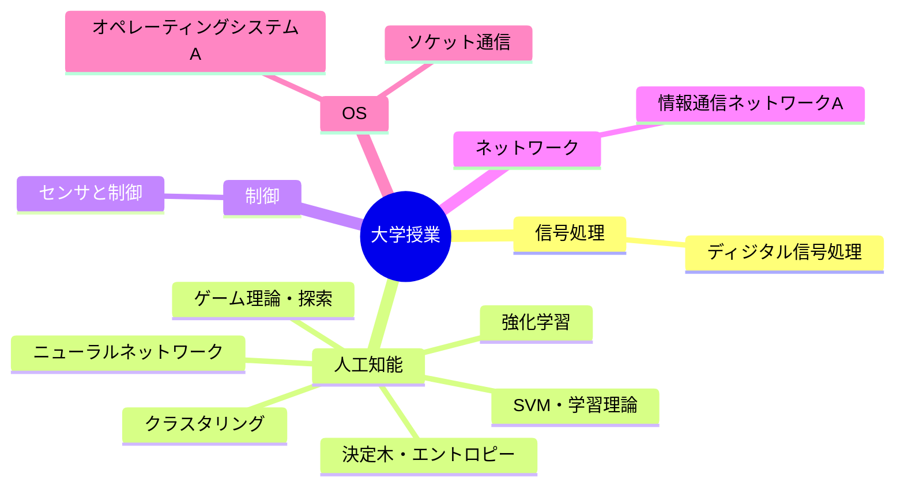

---
tags:
  - MOC
aliases:
  - 授業
created: 2026-05-13
status: active
---
## 概要・目的

早稲田大学基幹理工学部情報通信学科で履修する大学授業をまとめたMOC。外部講座や公開講義は `30_Resources/講座/` で管理する。
## 構造マップ

## 主要ノート

- [[ディジタル信号処理]] — 直交変換からDSP実装までを9単元に分けた授業ノートのハブ
- [[人工知能]] — AIの定義から知識表現までを9単元に分けた授業ノートのハブ
- [[人工知能_課題まとめ]] — Topic 1〜8に分けた人工知能の課題解答ハブ
- [[センサと制御]] — チャタリング ほか
- [[情報通信ネットワークA]] — 物理層からWeb・セキュリティまでを8単元に分けた授業ノートのハブ
- [[オペレーティングシステムA]] — UNIX・システムコール（内田担当。ソケット通信を含む）／仮想メモリ・デバイス管理・ファイルシステム・仮想化（中島担当）

## 関連MOC・上位MOC

- 上位: [[【MOC】20_Areas]]
- 関連: [[【MOC】講座]]

## 未整理・Inbox

- [ ] 

## メモ・気づき

---
**最終更新:** `= this.file.mtime`
