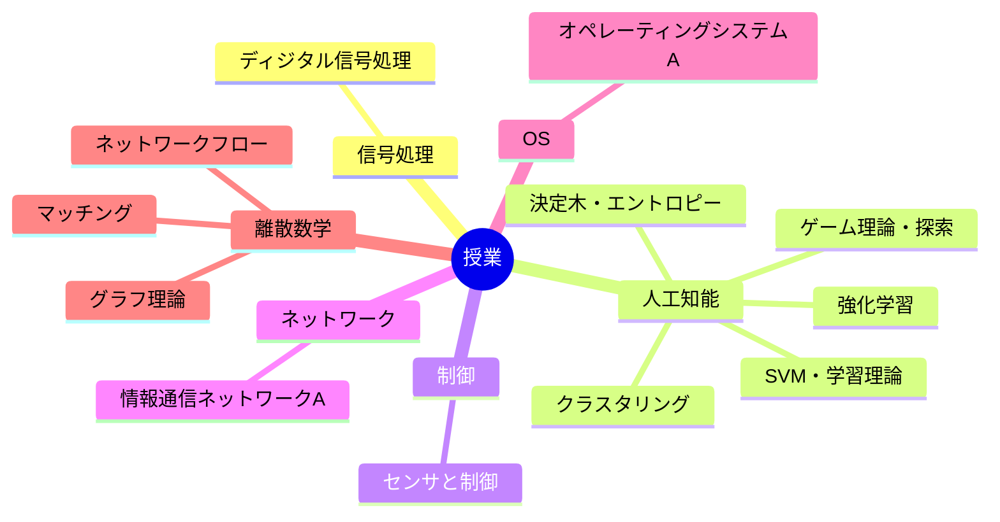

---
tags:
  - MOC
aliases:
created: 2026-05-13
status: active
---
## 概要・目的

早稲田大学基幹理工学部情報通信学科での授業内容をまとめたMOC。
## 構造マップ

## 主要ノート

- [[ディジタル信号処理]] — 直交変換・FIR/IIR・フィルタバンク・サンプリングレート変換・LPC・適応フィルタ・DSP実装
- [[人工知能]] — AIの定義から知識表現までを8単元に分けた授業ノートのハブ
- [[人工知能_課題まとめ]] — AIとエージェント・探索・決定木・強化学習・教師なし学習・SVM/AdaBoostの課題解答
- [[センサと制御]] — チャタリング ほか
- [[情報通信ネットワークA]] — 物理層からWeb・セキュリティまでを8単元に分けた授業ノートのハブ
- [[最適化アルゴリズム]] — 双対問題・整数計画・分枝限定法・切除平面法
- [[オペレーティングシステムA]] — UNIX・システムコール（内田担当）／仮想メモリ・デバイス管理・ファイルシステム・仮想化（中島担当）
- [[離散数学]] — 離散数学の章別ハブ
- [[離散数学_01_グラフ理論3]] — オイラー回路・ハミルトン閉路・TSP・頂点彩色・4色定理
- [[離散数学_02_グラフ理論4]] — 5色定理・平面グラフ・辺彩色・最大流
- [[離散数学_03_グラフ理論5]] — カット・最大フロー最小カット定理・マッチング・ホールの定理・ハンガリー法
- [[離散数学_04_ニューラルネットワークと計算グラフ]] — パーセプトロン・多層化・損失関数・計算グラフ・逆伝播

## 関連MOC・上位MOC

- 上位: [[【MOC】20_Areas]]
- 関連: 

## 未整理・Inbox

- [ ] 

## メモ・気づき

---
**最終更新:** `= this.file.mtime`
