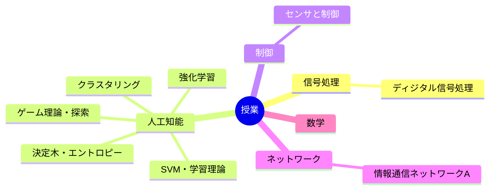

---
tags:
  - MOC
aliases:
created: 2026-05-13
status: active
---
## 概要・目的

早稲田大学基幹理工学部情報通信学科での授業内容をまとめたMOC。
## 構造マップ

## 主要ノート

- [[ディジタル信号処理]]
- [[人工知能]] — 機械学習の分類／ゲーム理論・決定木・強化学習・教師なし学習・PAC学習/SVM
- [[センサと制御]] — チャタリング ほか
- [[情報通信ネットワークA]] — インターネット層・IPアドレス・CIDR・経路制御

## 関連MOC・上位MOC

- 上位: [[【MOC】20_Areas]]
- 関連: 

## 未整理・Inbox

- [ ] 

## メモ・気づき

---
**最終更新:** `= this.file.mtime`
