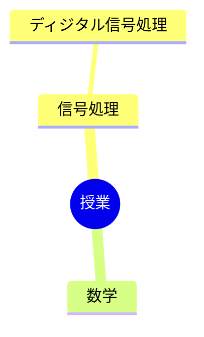

---
tags:
  - MOC
aliases:
created: 2026-05-13
status: active
---
## 概要・目的

早稲田大学基幹理工学部情報通信学科での授業内容をまとめたMOC。
## 構造マップ

## 主要ノート

- [[ディジタル信号処理]]

## 関連MOC・上位MOC

- 上位: [[【MOC】20_Areas]]
- 関連: 

## 未整理・Inbox

- [ ] 

## メモ・気づき

---
**最終更新:** `= this.file.mtime`
