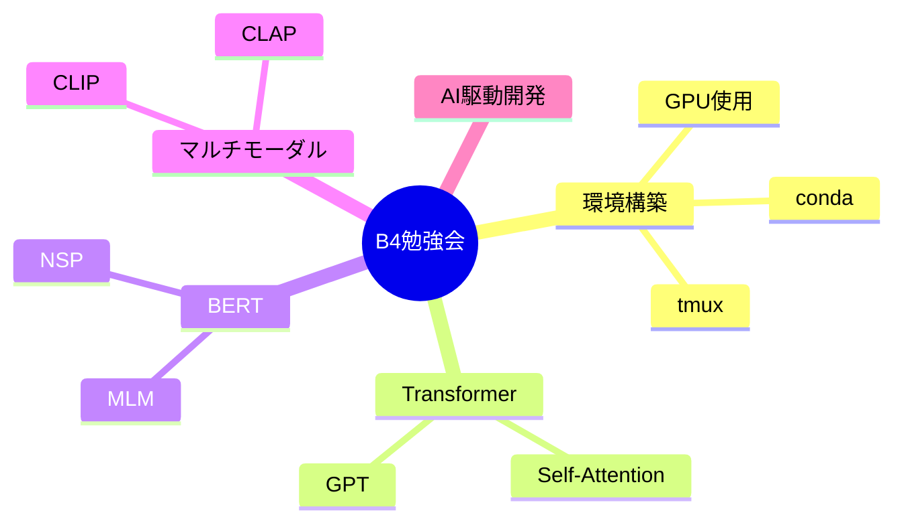

---
tags:
  - MOC
aliases:
  - 勉強会
  - B4
created: 2026-05-09
status: active
---
## 概要・目的

小川・小林研でのB4機械学習・深層学習勉強会で学んだことや気づきをまとめたMOC。

## 構造マップ

## 主要ノート

- [[20260423_勉強会02]] — GPU/tmux/conda・モデル学習の勘所
- [[20260430_勉強会03]] — Transformer・GPT（GPT-1〜InstructGPT）
- [[20260507_勉強会04]] — BERT・CLIP・CLAP
- [[20260514_勉強会05]] — SpeechLLM・VLM・AI駆動開発

## 関連MOC・上位MOC

- 上位: [[【MOC】機械学習・深層学習]]
- 関連: 

## 未整理・Inbox

- [ ] 

## メモ・気づき

---
**最終更新:** `= this.file.mtime`
