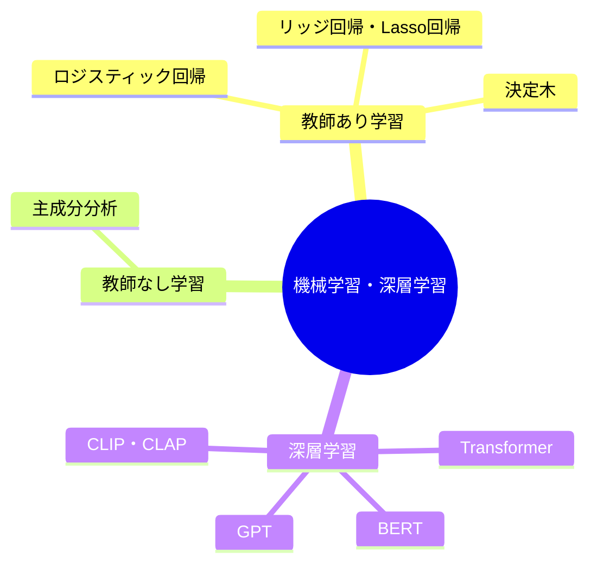

---
tags:
  - MOC
aliases:
created: 2026-05-09
updated: 2026-05-12
status: active
---
## 概要・目的

機械学習・深層学習に関する知識を体系的に整理したMOC。

## 構造マップ

## 主要ノート

### 機械学習
#### 教師あり学習
- [[ロジスティック回帰]]
- [[リッジ回帰・Lasso回帰]]
- [[決定木]]

#### 教師なし学習
- [[主成分分析]]

### 深層学習
- [[【MOC】B4勉強会]]

## 関連MOC・上位MOC

- 上位: [[【MOC】20_Areas]]
- 関連: [[【MOC】プロジェクト研究A]]

## 未整理・Inbox

- [ ] 

## メモ・気づき

---
**Last reviewed:** 2026-05-12
