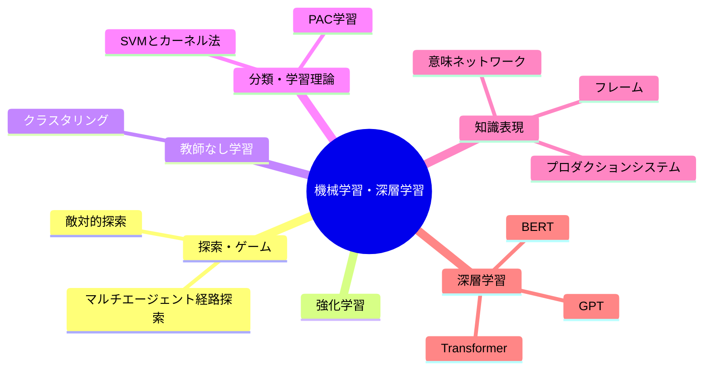

---
tags:
  - MOC
aliases:
  - ML
  - 機械学習
  - 深層学習
created: 2026-05-09
status: active
---
## 概要・目的

機械学習・深層学習に関する知識を体系的に整理したMOC。

## 構造マップ

## 主要ノート

### 機械学習
#### 探索・ゲーム
- [[敵対的探索]] — ミニマックス法とαβ枝刈り
- [[マルチエージェント経路探索]] — 協調エージェントの衝突回避（LRA*/CoopA*）

#### 強化学習
- [[強化学習]] — MDP・価値と方策・TD学習・Q学習

#### 教師なし学習
- [[クラスタリング]] — K-means・階層的クラスタリング

#### 分類・学習理論
- [[SVMとカーネル法]] — マージン最大化・カーネルトリック
- [[PAC学習]] — 「たぶん・だいたい・正しい」学習の枠組み

#### 知識表現
- [[知識表現]] — プロダクションシステム・意味ネットワーク・フレーム（記号AIの系譜）

### 深層学習
- [[Transformer]] — Self-Attentionを中心に系列を処理する基盤アーキテクチャ
- [[【MOC】B4勉強会]]

## 関連MOC・上位MOC

- 上位: [[【MOC】20_Areas]]
- 関連: [[【MOC】プロジェクト研究A]]

## 未整理・Inbox

- [ ] 

## メモ・気づき

---
**最終更新:** `= this.file.mtime`
