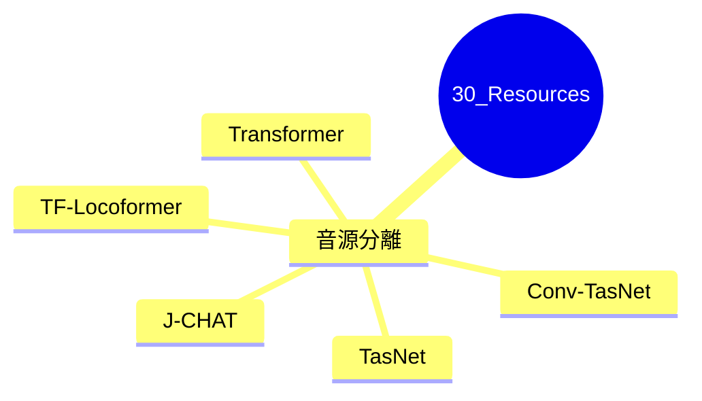

---
tags:
  - MOC
aliases:
created: 2026-05-12
updated: 2026-05-12
status: active
---
## 概要・目的

将来再利用できる参考資料・論文・リファレンスのハブMOC。特定プロジェクトに紐づかない汎用的な知識を蓄積する。

## 構造マップ

## 主要ノート

### 音源分離
- [[TasNet_メモ]]
- [[Conv-TasNet_メモ]]
- [[TF-Locoformer_メモ]]
- [[Transformer_メモ]]
- [[J-CHAT_メモ]]

## 関連MOC・上位MOC

- 上位: [[Home]]
- 関連: [[【MOC】プロジェクト研究A]]

## 未整理・Inbox

- [ ] 

## メモ・気づき

---
**Last reviewed:** 2026-05-12
