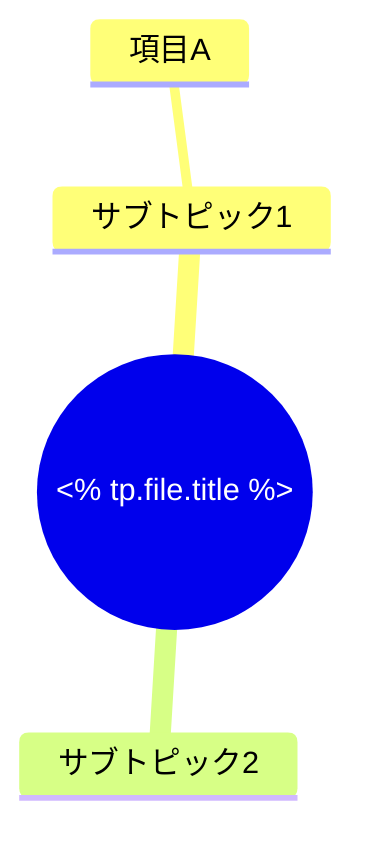

---
tags:
  - MOC
aliases:
created: <% tp.file.creation_date("YYYY-MM-DD") %>
status: active
---
## 概要・目的

## 構造マップ

## 主要ノート

- 

## 関連MOC・上位MOC

- 上位: 
- 関連: 

## 未整理・Inbox

- [ ] 

## メモ・気づき

---
**最終更新:** `= this.file.mtime`
